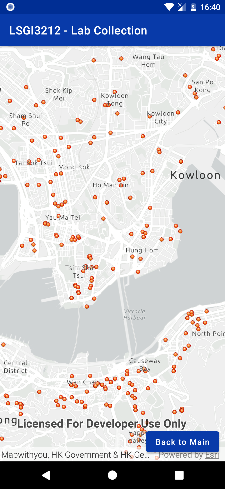
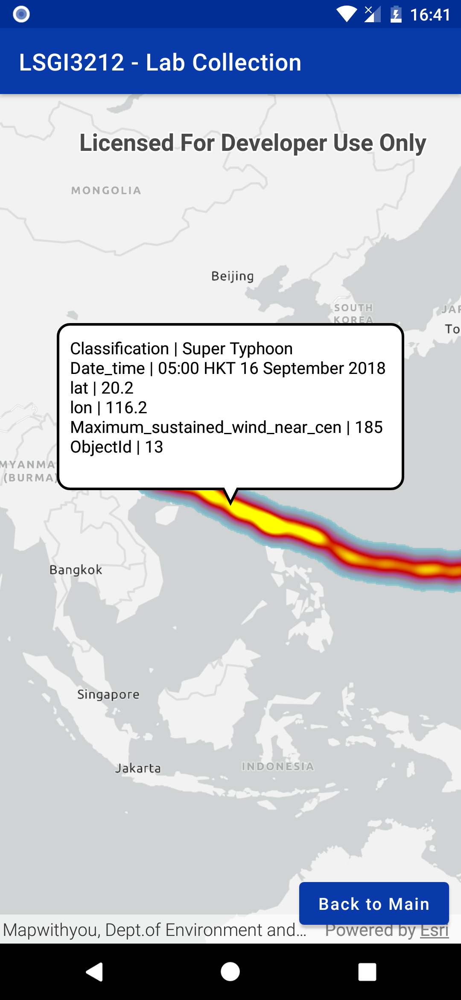
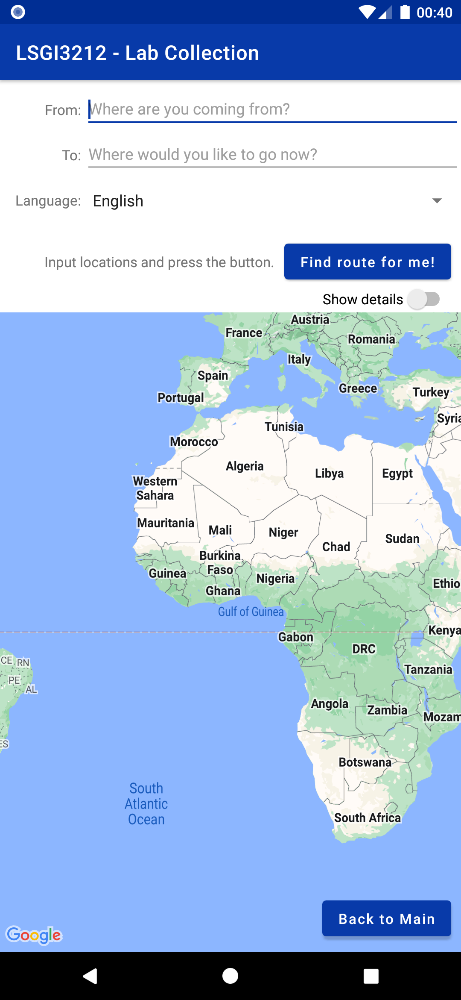

# LSGI3212-2022
This repository contains an Android Studio project as an all-in-one example of lab assignments for LSGI3212.

~~This project will be updated gradually as the course progresses.~~  
**As we already finished this course for 2022, I would like to put this repository as archived. For any enquiry, please feel free to send me an email!**

For the tutorial notes, see [here](https://xiaoshengzhu.notion.site/Lab-Tutorials-for-LSGI3212-Mobile-GIS-and-LBS-e8f3c248bb16492dafe06ee2165c83c4).

## Key files
- [Java codes](https://github.com/Gypsop/LSGI3212-2022/tree/main/app/src/main/java/com/lsgi3212/lab/collection)
- [XML layouts](https://github.com/Gypsop/LSGI3212-2022/tree/main/app/src/main/res/layout)
- [Value definitions](https://github.com/Gypsop/LSGI3212-2022/tree/main/app/src/main/res/values)

## Screenshots

      

